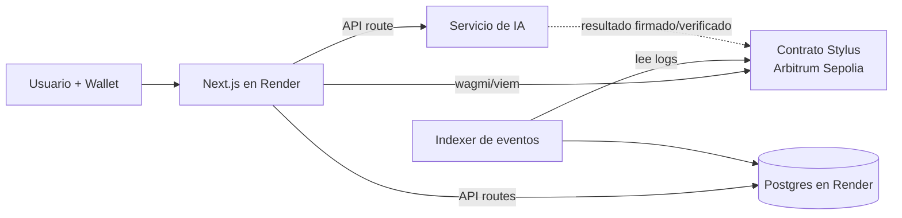

# Scaffold-ETH vs Scaffold-Stylus — y cómo encaja con "Next.js"

## Qué es un "Scaffold"

No es un framework nuevo. Es un **monorepo plantilla** que ya trae cableado todo lo aburrido
de una dApp:

```
scaffold/
├── packages/
│   ├── nextjs/       ← el frontend. Next.js (App Router) + wagmi + viem + RainbowKit + Tailwind
│   └── hardhat/      ← los contratos, tests y scripts de despliegue
│       (o foundry/ o stylus/ según la variante)
```

Incluye: botón de conectar wallet, hooks tipados a partir de la ABI, una página `/debug`
que autogenera una UI para llamar cualquier función de tu contrato, faucet local,
y regeneración automática de tipos al desplegar.

## Los dos scaffolds

| | **Scaffold-ETH 2** | **Scaffold-Stylus** |
|---|---|---|
| Contratos en | Solidity | **Rust (Stylus)** |
| Toolchain contratos | Hardhat o Foundry | `cargo stylus` |
| Frontend | Next.js + wagmi + viem | Next.js + wagmi + viem (prácticamente igual) |
| Bounty que habilita | 🟢 Basic | 🟡 Intermediate y 🔴 Advanced |
| Madurez | Muy maduro, mucha documentación | Más nuevo, menos ejemplos |
| Mantenido por | BuidlGuidl | Offchain Labs / comunidad Arbitrum |

## Punto importante: "Next.js" no está en conflicto con el bounty

Los bounties exigen usar Scaffold-ETH o Scaffold-Stylus **como base del proyecto**.
Ambos scaffolds **ya son Next.js**. Es decir:

> Usar Scaffold-Stylus **es** hacer el proyecto en Next.js. No hay que elegir.

Lo que sí cambia respecto a arrancar con `create-next-app` desde cero:
- El frontend vive en `packages/nextjs/` dentro de un monorepo con yarn workspaces.
- Ya vienen decisiones tomadas: Tailwind + DaisyUI, wagmi, RainbowKit, estructura de hooks.
- El despliegue en Render debe apuntar al subdirectorio `packages/nextjs`.

**Conclusión:** arrancar desde `create-next-app` sería un error — perdería el bounty y
tendría que reimplementar a mano toda la integración de wallet. Se parte del scaffold.

## Y la base de datos Postgres, ¿dónde entra?

Los scaffolds no traen base de datos porque la dApp mínima no la necesita.
Pero una app real sí, y añadirla suma en "Producto y UX" e "Implementación Técnica"
siempre que la división esté bien justificada:

| Va **on-chain** (contrato) | Va **off-chain** (Postgres) |
|---|---|
| Lo que necesita ser confiable, auditable o de propiedad verificable | Lo que es voluminoso, privado o solo sirve para la UI |
| Estado de verdad: saldos, registros, resultados, permisos | Caché de eventos para consultas rápidas |
| Reglas que nadie debe poder alterar | Perfiles, metadata, textos largos, imágenes |
| Verificación criptográfica / cómputo Stylus | Historial indexado, analítica, búsquedas |
| | Resultados de IA, colas de trabajos, logs |

**Anti-patrón que el jurado penaliza:** meter en Postgres lo que debería ser on-chain,
dejando al contrato como un adorno. Si la app funcionaría igual sin blockchain, se pierde
el 20% de "Uso del Ecosistema Arbitrum" y buena parte del 25% técnico.

**Patrón correcto:** el contrato es la fuente de verdad; Postgres es un **índice/caché**
de los eventos del contrato más los datos que no tienen sentido pagar por almacenar en cadena.

## Arquitectura objetivo



## Decisión propuesta

**Scaffold-Stylus** como base, apuntando al bounty 🔴 Advanced.
Con Scaffold-ETH (Solidity) como plan B si el despliegue Stylus se vuelve un bloqueo.
