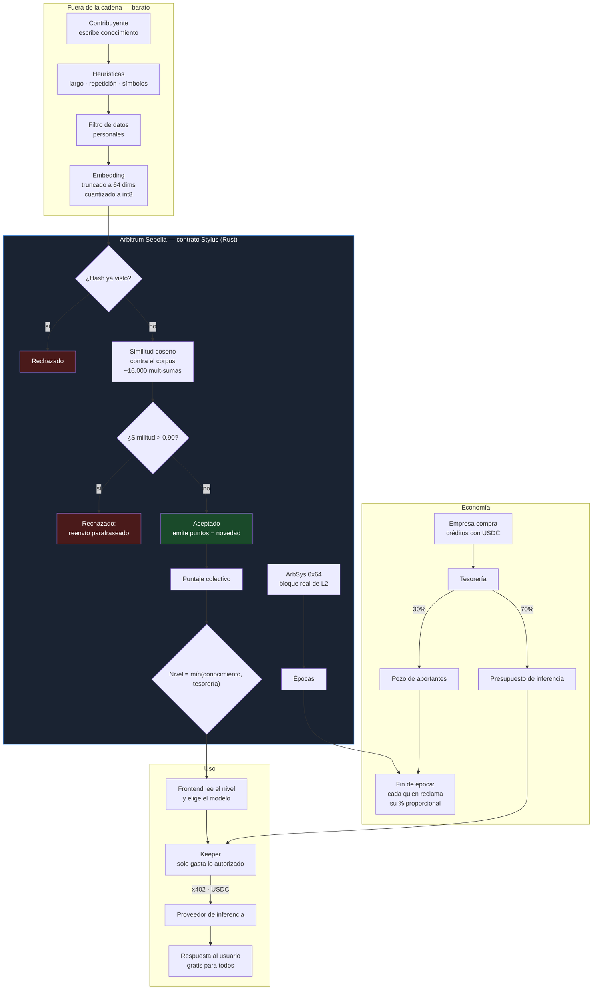

# BenevrIA — una IA que la comunidad enseña y sostiene

> **BenevrIA** = *benevolencia* + *IA*. Una inteligencia artificial concebida como bien
> común: la comunidad la enseña, todos la usan, y quien enseña cobra.

BenevrIA es una IA de **acceso gratuito para todos** cuyo **nivel de modelo lo decide un
contrato inteligente**, no un operador. La comunidad le enseña conocimiento; el contrato
verifica on-chain que cada aporte sea genuinamente nuevo, sube el nivel del modelo que
todos usan, y reparte los ingresos entre quienes enseñaron.

**Hackathon Ethereum Lima 2026 · Track Arbitrum · Categoría: IA y Tecnologías Emergentes**

---

## El problema

Las IAs se entrenan con el conocimiento de la gente y después se lo cobran de vuelta.
Quien tiene conocimiento escaso —el trámite que nadie escribió, la jerga de un oficio, el
procedimiento que los modelos alucinan— no recibe nada por él. Y quien no puede pagar una
suscripción mensual se queda fuera del acceso.

## La solución

| | Cómo funciona |
|---|---|
| **Enseñar** | Aportas conocimiento. El contrato verifica que sea nuevo comparándolo contra el corpus. |
| **Subir de nivel** | La novedad acumulada de la comunidad desbloquea modelos mejores **para todos**. |
| **Usar** | La IA es gratis para cualquiera, aporte o no. Ese es el bien común. |
| **Cobrar** | Los ingresos se reparten en proporción exacta a la novedad que cada quien aportó. |

### Las dos separaciones que sostienen el diseño

**1. El nivel es colectivo; el dinero es individual.**
Todos usan el modelo que la comunidad ganó, incluso quien nunca aportó. Pero solo cobra
quien aportó. Que el free-rider se beneficie no es un defecto, es la tesis: una IA que es
un bien común.

**2. Los créditos se venden; los puntos se ganan.**
Vender créditos es vender un servicio. Los puntos son un derecho de cobro sobre la
tesorería y **no se pueden comprar** — emitirlos contra dinero en vez de contra trabajo
diluiría a quien enseñó.

### Qué sube y qué baja el nivel

El nivel **sube por conocimiento** y **baja por falta de fondos**. Esa asimetría es
deliberada: castigar a todos por el spam de un troll haría que la gente se fuera, mientras
que *"no hay con qué pagar la inferencia"* es honesto, automático y auditable.

---

## Por qué esto necesita una blockchain

La pregunta que este proyecto tiene que responder es *"¿no funcionaría igual con una base
de datos?"*. No, y por una razón concreta: **un servidor puede calcular exactamente lo
mismo, pero no puede probarlo.**

Las tres decisiones que viven on-chain son justo aquellas donde el operador tendría
incentivo a mentir:

| Decisión | Si la tomara un backend |
|---|---|
| ¿Este aporte es novedoso? | *"Es duplicado, no cobras"* — incomprobable |
| ¿Qué nivel de modelo corre? | *"Bajó de nivel"* mientras se embolsa la diferencia |
| ¿Cuánto le toca a cada quien? | Reparto opaco |

## Por qué Stylus y no Solidity

El ataque económicamente racional contra un sistema de "aporta y gana" no es escribir
basura —eso lo filtran heurísticas triviales fuera de la cadena— sino **reenviar
conocimiento que ya está en el corpus, ligeramente reformulado**.

Detectarlo exige comparar el vector del aporte nuevo contra todo lo almacenado: con una
ventana de 256 vectores de 64 dimensiones son **~16.000 multiplicaciones-sumas por
transacción**. En la EVM cada operación consume gas de opcode y el corpus se lee palabra a
palabra, hasta volverlo impagable. En WASM compilado a código nativo es aritmética de
registro.

> **"Usamos Stylus porque hacer esto en Solidity sería impagable en gas."**

---

## Arquitectura



### Qué corre dónde, y por qué

El **modelo de IA no vive en el contrato** — no cabe, y fingir lo contrario sería mentir.
La IA corre fuera de la cadena, que es lo esperado. Lo que vive dentro es la
**verificación**: la IA produce el dato, el contrato lo juzga. Esa es la división correcta,
y la parte que se verifica es justo la única que necesita ser trustless, porque es la que
decide si a alguien se le paga.

### Filtrado por capas, de lo barato a lo caro

Así filtran los datasets de verdad, y así está implementado:

| Capa | Dónde | Qué hace |
|---|---|---|
| 0 · Heurísticas | off-chain | largo, repetición, ratio de símbolos, secuencias absurdas |
| 1 · Datos personales | off-chain | correos, teléfonos, tarjetas, wallets, credenciales |
| 2 · **Deduplicación** | **on-chain** | **similitud coseno contra el corpus — la que decide el pago** |
| 3 · Juez LLM | roadmap | evaluación sobre muestra |
| 4 · Disputas optimistas | roadmap | ventana de desafío con stake, igual que Arbitrum valida su estado |

---

## Uso del ecosistema Arbitrum

| Pieza | Cómo se usa |
|---|---|
| **Stylus** | Todo el núcleo: matemática vectorial en punto fijo, imposible de costear en Solidity |
| **ArbSys (`0x64`)** | Bloque real de L2 para las épocas. En Arbitrum `block.number` devuelve el bloque de **L1** — usarlo daría un reloj equivocado |
| **Arbitrum Sepolia** | Red de despliegue (chainId 421614) |
| **x402** | Pago de inferencia en USDC desde la tesorería. El facilitador de PayAI soporta `arbitrum-sepolia` (verificado) |

---

## Contratos desplegados

| Contrato | Red | Dirección | Arbiscan |
|---|---|---|---|
| `BenevriaCore` | Arbitrum Sepolia | *(pendiente de despliegue)* | — |

---

## Instalación

### Requisitos

- **Node.js** ≥ 20
- **Rust 1.91.0** (lo instala solo el `rust-toolchain.toml`)
- **cargo-stylus 0.10.8** exacto — `cargo install --force --locked cargo-stylus@0.10.8`
  > ⚠️ No uses `stylusup`: instala versiones incompatibles con este scaffold.

### Pasos

```bash
git clone <este-repo>
cd proyecto

# Instalar dependencias.
# ignore-scripts está activo a propósito, ver "Seguridad" abajo.
yarn install

# Compilar y probar el contrato
cd packages/stylus/contracts/benevria-core
cargo test                  # 28 tests
cargo stylus check --endpoint https://sepolia-rollup.arbitrum.io/rpc

# Desplegar (requiere PRIVATE_KEY fondeada en packages/stylus/.env)
cd ../../../..
yarn deploy

# Frontend
cp packages/nextjs/.env.example packages/nextjs/.env.local
# rellenar NEXT_PUBLIC_BENEVRIA_ADDRESS con la dirección desplegada
yarn start                  # http://localhost:3000

# Sembrar el corpus con conocimiento real, para que el demo tenga sustancia
yarn sembrar
```

### Variables de entorno

`packages/stylus/.env`

| Variable | Para qué |
|---|---|
| `PRIVATE_KEY` | Clave de despliegue (wallet de testnet desechable) |
| `RPC_URL` | RPC de Arbitrum Sepolia |

`packages/nextjs/.env.local`

| Variable | Obligatoria | Para qué |
|---|---|---|
| `NEXT_PUBLIC_BENEVRIA_ADDRESS` | sí | Dirección del contrato desplegado |
| `OPENROUTER_API_KEY` | no | Inferencia. Sin ella el chat explica el estado en vez de responder |
| `EMBEDDINGS_API_KEY` | no | Embeddings semánticos. Sin ella se usa el respaldo léxico local |
| `BENEVRIA_MODO_PAGO` | no | `apikey` (por defecto) o `x402` |

---

## Rutas

| Ruta | Necesita wallet | Qué hace |
|---|---|---|
| `/` | no | Portada: problema, cómo funciona, por qué on-chain |
| `/chat` | **no** | La IA, gratis para cualquiera. Lee el nivel del contrato para elegir modelo |
| `/aportar` | sí | Enseñar conocimiento. Separa la capa off-chain de la verificación on-chain |
| `/temas` | sí | Panel de demanda: pedir y votar temas |
| `/panel` | no | Estado del protocolo: nivel, corpus, tesorería, época, bloque L2 |
| `/recompensas` | sí | Cobrar lo que corresponde, con el cálculo del reparto a la vista |
| `/debug` | sí | Interfaz cruda del contrato (viene del scaffold) |

> El chat **no** pide wallet a propósito: la IA es gratis para todos, aporten o no.
> Ponerle un muro contradiría la tesis del proyecto. Y en web3 no hay "iniciar sesión" —
> la wallet **es** la identidad, y solo hace falta para escribir en la cadena.

## Tests

```bash
cd packages/stylus/contracts/benevria-core && cargo test
```

**28 tests**, divididos en dos grupos:

- **Matemática vectorial** (10): identidad, ortogonalidad, vectores opuestos, empaquetado
  con negativos (el caso que rompe una implementación ingenua: `-1` como `u8` es `255`),
  no-desbordamiento en el peor caso, salida temprana.
- **Contrato** (18): rechazo de duplicados exactos y parafraseados, aceptación de
  conocimiento ortogonal, subida de nivel por conocimiento, tope por tesorería, reparto
  proporcional, límites del keeper, panel de temas.

---

## Seguridad de la cadena de suministro

Este proyecto se montó durante una **campaña activa** de ataques a npm
(*ChainDrop / Shai-Hulud*, 4–6 de agosto de 2026: ~444 paquetes y 2.234 versiones
envenenadas, robando tokens y **wallets de cripto**). `flat-cache` y `file-entry-cache`
están entre los afectados, y son dependencias de eslint — o sea, entran solas.

Medidas tomadas:

- **`ignore-scripts` / `enableScripts: false`** — el vector siempre es un hook
  `preinstall`/`postinstall`. Desactivarlos neutraliza el payload sin tener que saber qué
  paquete está comprometido.
- **`before=2026-07-27`** en `.npmrc` — las versiones envenenadas quedan fuera de alcance
  por construcción.
- **Clonado por git, no `npx create-*`** — `npx` ejecuta código arbitrario de inmediato.
- **Binario de yarn verificado por hash** contra el release oficial de `repo.yarnpkg.com`.
- **Eliminados** `.husky/` (git hooks) y `.claude/skills/` (instrucciones a agentes de IA)
  que venían en el scaffold clonado.

Detalle completo en `../bitacora/03-seguridad.md`.

---

## Limitaciones conocidas

Se declaran en vez de disimularse:

1. **El último tramo del pago no es trustless todavía.** OpenRouter aún no acepta x402
   (verificado contra su API: solo `Authorization: Bearer`). Hasta que complete su
   migración, el gateway paga al proveedor con una API key. El protocolo está listo; falta
   el proveedor.
2. **El embedding local es léxico, no semántico** — y está medido, no supuesto.
   Comparando un mismo trámite escrito de tres formas contra el original:

   | Variante | Similitud | Veredicto del contrato |
   |---|---|---|
   | Reenvío casi idéntico | **99,3 %** | ❌ rechazado como duplicado |
   | Reescrito con otras palabras | 67,5 % | ✅ aceptado |
   | Tema distinto | 22,1 % | ✅ aceptado |

   O sea: el respaldo local **sí mata el reenvío**, que es el ataque económicamente
   racional, pero **deja pasar el parafraseo profundo**. Con `EMBEDDINGS_API_KEY`
   apuntando a un modelo de embeddings real, el segundo caso también se detecta. La
   lógica del contrato no cambia: cambia la calidad del vector que recibe.
3. **El filtro de datos personales es un mejor esfuerzo.** Ningún filtro de PII es
   infalible y prometerlo sería exposición legal gratuita.
4. **La ventana del corpus es de 256 vectores.** Sin tope, el costo de aportar crecería
   sin límite. El barrido histórico completo es trabajo off-chain.

---

## Créditos

Ver [`CREDITOS.md`](./CREDITOS.md).

## Licencia

MIT
